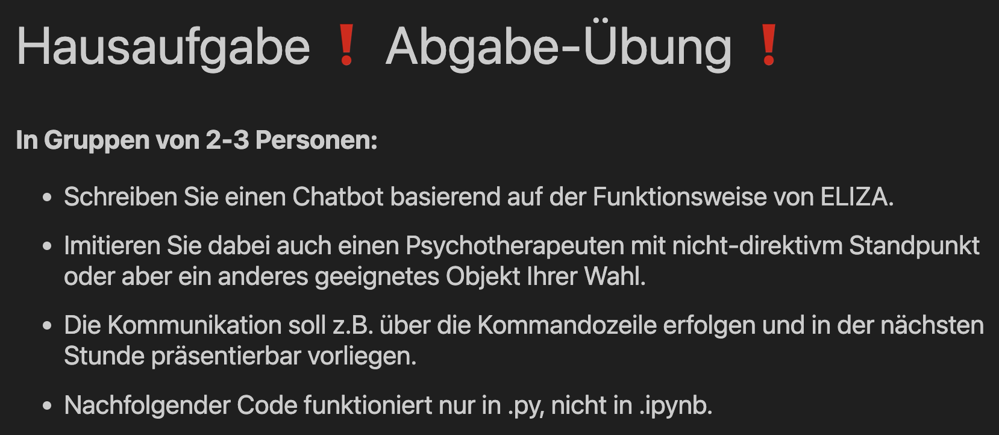
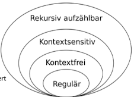

# Pal-Bot



## Chatbot starten

```bash
cd [REPO]/pal-bot

# Create uv project
uv init

# Set Python version to use
uv python pin 3.12.9

# Run script
uv run sophisticated.py
```

## Schwierigkeiten 

* wir beachten hier nur die Syntax, nicht aber Semantik
* Muster müssten sehr stark erweitert werden, um sinnvolle Antworten zu liefern
    * so wird oft eine Fallback-Antwort geliefert

* Umfassendes Wörterbuch müsste bereitgestellt werden

* Für die Erkennung von Satzbausteinen müsste man eine Bilbiothek wie NLTK oder spaCy verwenden

* Kann nur reguläre Sprachen erkennen (Typ 3)


